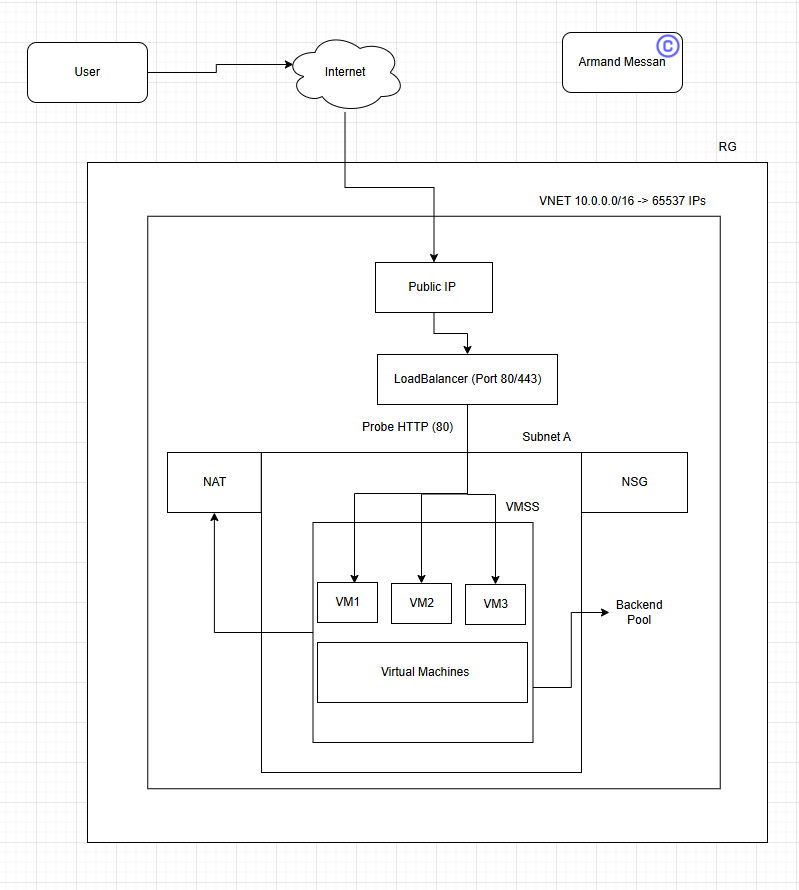
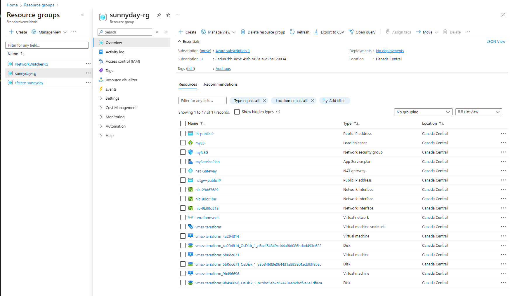
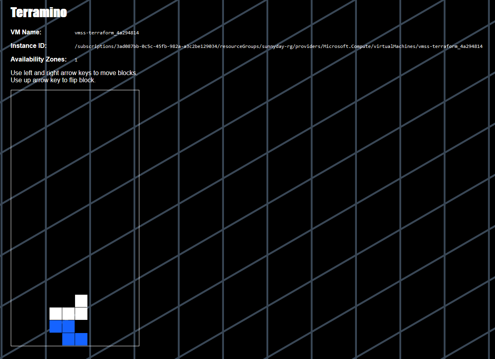

# project 1 - Azure resources using Terraform
In this project we'll be creating many resources with the help of terraform.
We'll be using virtual machines, virtual machines scale sets, load balancer, public ip, nat gateway, 
and deploying a working application.

Let's first understand the application architecture we are going to deploy.



We will create a ``resource group``. Inside the resource group we have our ``virtual network`` (VNET). 
Inside the vnet we create a ``subnet`` (Subnet A), and inside the subnet we create our resources.

Resources are a ``virtual machine scale set`` (VMSS), inside the vmss we have multiple virtual machines, scaling up and down based on the demand and rules we have set.

We also add a ``loadbalancer`` on which the application will be accessed. This loadbalancer will be running traffic on port 80 or 443;
it should have the traffic allowed on these ports from outside the internet. In order for the loadbalancer to communicate
with the backend servers, it will add those servers as backend pool. It load balances the traffic accross multiple servers with
the help of loadbalancing rules. The loadbalancer will check the server, if it is healthy it will keep sending the requests to it,
it is called probe or probing the server.

We'll create ``HTTP prob`` on port 80, from loadbalancer to the backend servers (virtual machines).
We create a ``public ip`` and associate it to the loadbalancer, so that any request that comes from the internet will be redirected
to the loadbalancer, and the loadbalancer redirects it to the healthy server.

The virtual machine should only be accessed by the loadbalancer and not from the outside. To restrict the access of the vm 
by anyone, we create a ``network security group`` (NSG) and attach it to the subnet.
The nsg will have rules such as `allow acces from loadbalancer` and `block everything else`.

We created another resource ``NAT gateway``, that will allow the servers to download patches and updates if the traffic (incoming and outcoming) is blocked.
It redirects the requests that come from the VMs and it'll route it ot the internet gateway, so that the servers can download
the updates in a secure way for example without exposing themselves to the outside internet.
NAT creates some net rules and based on that it'll redirect the requests.

Autoscaling rules:
- default 2 VMs
- minimum 1 vm
- maximum 5 VMs
- CPU > 80% -> add new vm (scale out)
- CPU < 10% -> delete VM (scale in)

The ``terraform statefile`` will be stored in a ``blobstorage``. When the developer runs terraform init, it will refer the statefile
as the local backend, but it is actually the remote backend. 
Then the developer can run terraform plan and apply against the infrastrcuture to provision it.

First run ``backend.sh``, to create a resource group, a storage account, and then a blob storage. At the end of the output you should see:
```
{
  "created": true
}
```

Now you can run to create all resources
```
terraform init 
terraform plan
terraform apply
```

Now let's heat to `azure portal` > `Resources Group`.
The first resource group is `tfstate-sunnyday`, where the tfstate file is saved.
The second resource group is `sunnyday-rg`, where all other resources (vmss, nat, nsg, etc...) are created



To access one of the backend server, we go to, `sunny-rg` > `Overview` > `lb-publicIP`, and copy the `DNS name`, `sunnyday-rg-prime-finch.canadacentral.cloudapp.azure.com`.
In a webbrowser we paste the `DNS name`, followed by `/index.php`. It should look like this `sunnyday-rg-prime-finch.canadacentral.cloudapp.azure.com/index.php`.
This page should appear with a tetris game in it



On the page you can see the currently used VM `vmss-terraform_<xxx>` under `VW Name`. And if you try the quickly refresh the page, at some point you will notice that the VM name changes. That means the requests are being redirected to another VM.

Now that you are done, destroy everything
```
terraform destroy
```