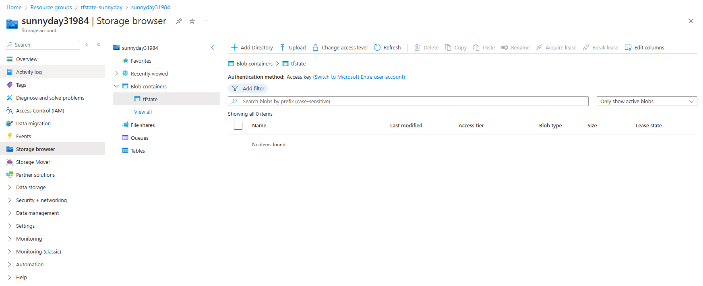
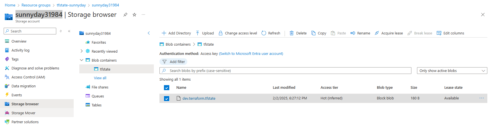

# Terraform State File

## How Terraform update Infrastructure
- Goal is to keep the actual state same as the desired state
- The actual state resides inside a file called statefile
- Create Azure resources such as resource group and storage account using a remote backend
### Note: 
We are using in this example the RBAC just like we did [here](../resource_group_and_storage_account/readme.md#commands-used), that's we are not prompted to enter the access keys.
In case you can not setup the RBAC with `Contributor` role, make sure to get the access keys from the storage account, assign to a variable, then access it.

## State file best practices
- Store state file to a remote backend: when we run the TF commands, it'll access the file from remote, and run it as local, and then make changes to the infrastructure.
- Do not update / delete the file
- State locking: to prevent inconsistincy, when different developers try to access the same file at the same time
- Isolation of state file: for different environment we can create different files
- Regular backup: to prevent accidental deletion

First run ``backend.sh``, to create a resource group, a storage account, and then a blob storage. At the end of the output you should see:
```
{
  "created": true
}
```
You can also check on the azure portal



After running
```
terraform init 
terraform plan
```
and when we refresh the blob storage page, we should now see there's a new tfstate file `dev.terraform.tfstate`. The name of the file should match with the one we specified in the the `main.tf`.
`dev.terraform.tfstate` is our remote backend



You can now run
```
terraform apply
```
to deploy your resources, and following to destroy everything
```
terraform destroy
```